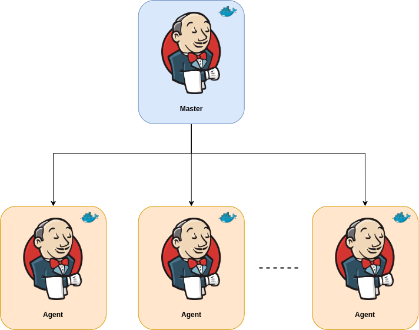

# Jenkins Setup

This setup provides a Jenkins instance and its agent.

## Jenkins Master

The Jenkins Master is responsible for managing the Jenkins agents.

## Jenkins Agent

The Jenkins agent is responsible for executing the jobs and running the build tasks.

## Architecture

  </a>

